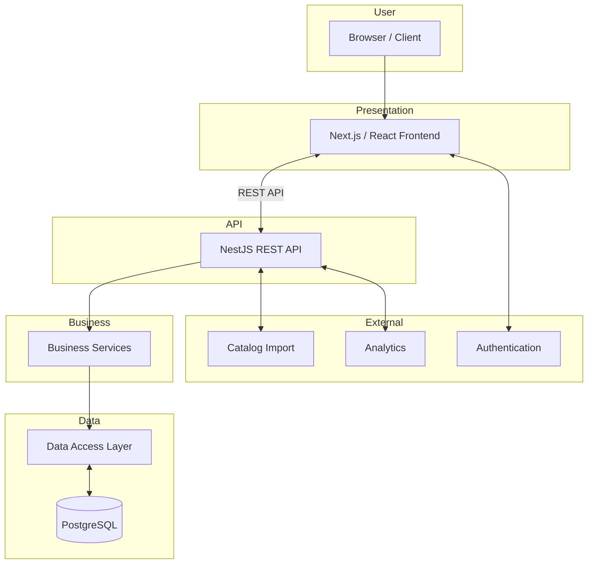
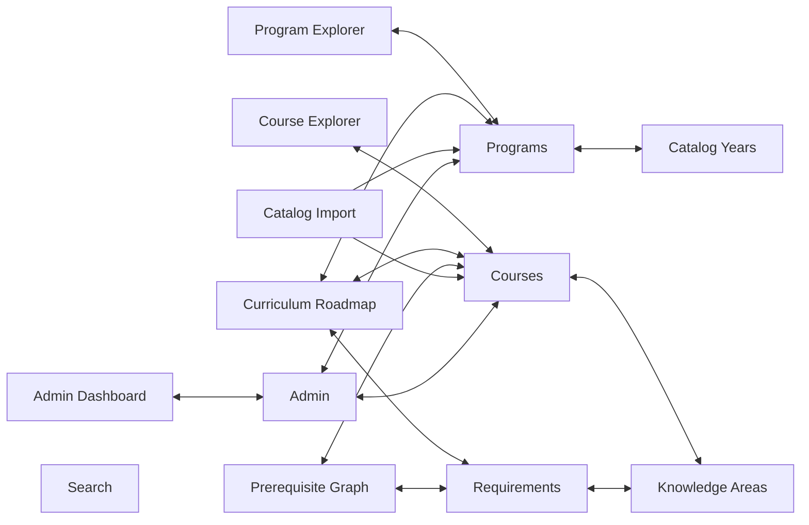
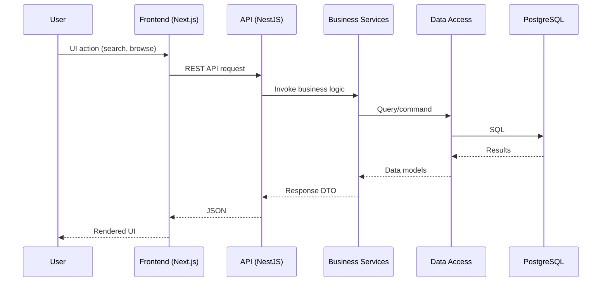

# SFBU ECE Program Explorer — Architecture Specification

---
**Document Version:** 1.0
**Status:** Draft
**Last Updated:** 2024-06-24
**Authors:** SFBU ECE Program Explorer Team
---

## Revision History

| Version | Date       | Author             | Description                          |
|---------|------------|--------------------|--------------------------------------|
| 1.0     | 2024-06-24 | Team               | Initial architecture specification   |

---

## 1. Purpose

This document specifies the architecture of the SFBU ECE Program Explorer. It provides a comprehensive overview of system structure, key components, data flows, technology choices, and architectural rationale to guide development and maintenance.

## 2. Architectural Goals

- **Modularity:** Facilitate independent development, testing, and deployment.
- **Scalability:** Support increasing loads and future feature expansion.
- **Maintainability:** Enable easy updates, debugging, and onboarding.
- **Security:** Protect sensitive academic and user data.
- **User Experience:** Deliver intuitive, responsive, and performant interfaces.
- **Extensibility:** Allow integration with external systems and future enhancements.

## 3. Architectural Principles

- **Separation of concerns:** Distinct layers for presentation, business logic, data access, and storage.
- **API-first:** All data access through RESTful APIs.
- **Statelessness:** APIs are stateless, enabling horizontal scaling.
- **Single source of truth:** PostgreSQL is the authoritative data store.
- **Reusable components:** Both frontend and backend use modular, reusable components.
- **Infrastructure as Code:** Deployment and configuration are automated and reproducible.

## 4. High-Level Architecture Overview

The SFBU ECE Program Explorer follows a layered, service-oriented architecture. The main layers are:

- **Presentation Layer:** Next.js/React frontend.
- **API Layer:** NestJS REST API.
- **Business Services Layer:** Encapsulates domain logic.
- **Data Access Layer:** Manages database interactions.
- **Database Layer:** PostgreSQL.
- **External Integrations:** Catalog import, authentication, and analytics.

### High-Level Architecture Diagram


## 5. Layered Architecture

| Layer               | Description                                                                                 |
|---------------------|--------------------------------------------------------------------------------------------|
| Presentation        | Next.js/React frontend; renders UI, handles routing, invokes API, manages client state     |
| API                 | NestJS REST API; exposes endpoints for all data/services; validates and authorizes requests|
| Business Services   | Implements domain logic for programs, courses, requirements, etc.                          |
| Data Access         | ORM (TypeORM) for database queries, transactions, migrations                               |
| Database            | PostgreSQL; stores all catalog, course, and program data                                   |
| External Integrations| Catalog import (CSV/JSON), authentication (SSO/OAuth), analytics (Google Analytics, etc.) |

## 6. Technology Stack

| Area            | Technology              | Purpose                               |
|-----------------|------------------------|---------------------------------------|
| Frontend        | Next.js (React, TS)    | UI, routing, SSR/SSG                  |
| State Mgmt      | React Context, SWR     | Local/global state, data fetching     |
| Styling         | Tailwind CSS           | Responsive, utility-first styling     |
| Backend         | NestJS (Node.js, TS)   | API server, business logic            |
| ORM             | TypeORM                | Data access abstraction               |
| Database        | PostgreSQL             | Persistent storage                    |
| Auth            | OAuth2 / SSO           | User authentication                   |
| Containerization| Docker                 | Deployment, environment consistency   |
| Reverse Proxy   | Nginx                  | SSL termination, routing, static files|
| Monitoring      | Prometheus, Grafana    | Metrics and dashboards                |
| Logging         | Winston (Node), Logrotate| Application and access logs         |
| Testing         | Jest, React Testing Library | Unit/integration tests           |

## 7. Component Architecture

### Frontend Modules

- **Program Explorer:** Browse/search ECE programs, filter by criteria.
- **Course Explorer:** Search and filter courses, view details.
- **Curriculum Roadmap:** Visualize recommended course sequences.
- **Prerequisite Graph:** Interactive graph of course prerequisites.
- **Admin Dashboard:** Manage catalog data, users, and analytics.

### Backend Modules

- **Programs:** CRUD and querying of program data.
- **Courses:** CRUD and querying of course data.
- **Requirements:** Logic for degree/certificate requirements.
- **Knowledge Areas:** Tagging and querying by knowledge area.
- **Catalog Years:** Manage versioned curriculum data.
- **Search:** Full-text and faceted search across entities.
- **Admin:** User management, role-based access, audit logs.
- **Catalog Import:** ETL for importing catalog data from external sources.

### Component Relationship Diagram


## 8. Data Flow Descriptions

1. **User Interaction:**
   User interacts with the frontend (e.g., searching for a course).
2. **API Request:**
   Frontend sends REST API request (e.g., `/api/courses?search=...`) to backend.
3. **Business Logic:**
   Backend validates, authorizes, and processes the request using business services.
4. **Data Access:**
   Business service queries PostgreSQL via TypeORM.
5. **Response:**
   Backend returns structured JSON to frontend.
6. **Presentation:**
   Frontend updates UI with new data.

### Request Flow Diagram


## 9. Deployment Architecture

The system is containerized using Docker and orchestrated via Docker Compose or Kubernetes. Nginx acts as a reverse proxy, serving static frontend assets and routing API traffic.

- **Frontend:** Runs as a Next.js Docker container.
- **Backend:** Runs as a NestJS Docker container.
- **Database:** PostgreSQL in a managed or containerized instance.
- **Nginx:** Reverse proxy and SSL termination.
- **Optional:** Monitoring/logging containers (Prometheus, Grafana, etc.)

## 10. Security Architecture

- **Authentication:** OAuth2/SSO for user login; JWT tokens for API.
- **Authorization:** Role-based access control (RBAC) for admin endpoints.
- **Data Validation:** Input validation and output encoding at API.
- **Transport Security:** TLS/SSL for all external communications.
- **Secrets Management:** Environment variables, Docker secrets, or vault.
- **Audit Logging:** Track admin actions and sensitive operations.

## 11. Scalability Considerations

- **Stateless API:** Enables horizontal scaling of backend.
- **Database Connection Pooling:** Optimized for concurrent requests.
- **Caching:** Use SWR on frontend, Redis (optional) on backend for hot data.
- **Load Balancing:** Nginx or cloud LB for distributing requests.
- **Asynchronous Tasks:** For catalog import and heavy processing.

## 12. Logging and Monitoring

- **Application Logs:** Winston logger (backend), browser console (frontend).
- **Access Logs:** Nginx logs.
- **Monitoring:** Prometheus scrapes metrics from API; Grafana dashboards.
- **Error Tracking:** Sentry or similar for frontend and backend.
- **Alerting:** Email/Slack alerts for critical failures.

## 13. Coding and Design Patterns

- **Frontend:** Atomic Design, Container/Presentational components, Hooks, Context API.
- **Backend:** Dependency Injection (NestJS), Repository pattern, DTOs, Service Layer.
- **Testing:** Unit and integration tests; TDD encouraged.
- **Documentation:** Typedoc (backend), Storybook (frontend), OpenAPI (API).

## 14. Folder Structure

### Frontend (`/frontend`)
```
frontend/
  ├── components/
  ├── pages/
  ├── modules/
  ├── styles/
  ├── hooks/
  ├── context/
  ├── public/
  └── utils/
```

### Backend (`/backend`)
```
backend/
  ├── src/
  │   ├── modules/
  │   ├── common/
  │   ├── config/
  │   ├── database/
  │   ├── dto/
  │   ├── entities/
  │   └── main.ts
  ├── test/
  └── scripts/
```

## 15. Architecture Decision Records (ADR) Summary

- **ADR-001:** Adopt Next.js/React for frontend for SSR/SSG and flexibility.
- **ADR-002:** Use NestJS for backend for modularity and TypeScript support.
- **ADR-003:** PostgreSQL chosen for relational data and strong querying.
- **ADR-004:** Containerization with Docker for development and deployment.
- **ADR-005:** REST API (not GraphQL) for simplicity and compatibility.
- **ADR-006:** Use TypeORM for backend data access abstraction.
- **ADR-007:** OAuth2/SSO as authentication standard.
- **ADR-008:** Modular repo structure for separation of concerns.

## 16. References

- **[SRS]**: [01-Requirements.md](./01-Requirements.md)
- **[Database Spec]**: [03-Database.md](./03-Database.md)
- **[API Spec]**: [04-API.md](./04-API.md)
- **[UI/UX Guidelines]**: [05-UIUX.md](./05-UIUX.md)
- **[Epics]**: [epics/](../epics/)

---

**End of Architecture Specification**