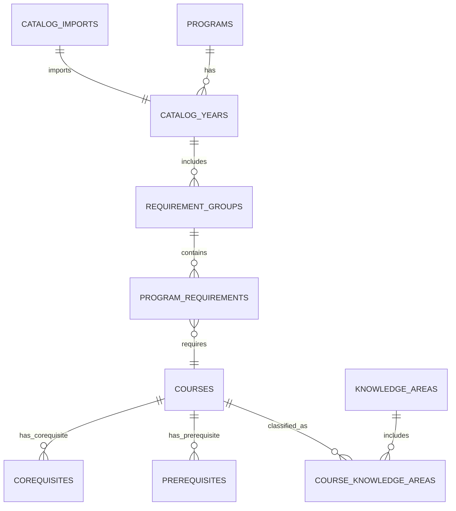

# SFBU ECE Program Explorer – Database Design Specification

**Version:** 1.0
**Status:** Draft
**Revision History:**
| Version | Date       | Author       | Description                  |
|---------|------------|--------------|------------------------------|
| 1.0     | 2024-06-01 | SFBU ECE Team| Initial draft of specification|

---

## 1. Purpose

This document specifies the database design for the SFBU ECE Program Explorer application. It outlines the data model, entities, relationships, and design principles to support a flexible, maintainable, and scalable database backend that powers the exploration and analysis of Electrical and Computer Engineering (ECE) academic programs and their requirements at San Francisco Bay University (SFBU).

---

## 2. Database Goals

- Provide a normalized and consistent data model representing ECE programs, course catalogs, and requirements.
- Support versioning of academic catalogs to reflect changes over time.
- Ensure data integrity and referential consistency.
- Facilitate efficient querying for program and course requirement exploration.
- Enable extensibility to accommodate future program changes.
- Support auditability and traceability of data changes.
- Integrate with application layers via ORM for maintainability.

---

## 3. Scope and Out-of-Scope

### In Scope
- Representation of academic programs and their degree requirements.
- Storage of course information, knowledge areas, and prerequisite structures.
- Versioned catalogs capturing program requirements by academic year.
- Import workflows for catalog data ingestion.

### Out of Scope
- Student records, enrollment data, and grades.
- Student Information System (SIS) data integration.
- Real-time registration or academic progress tracking.
- Financial or administrative data.

---

## 4. Database Technology

- **Database Engine:** PostgreSQL (preferred for advanced relational features and extensibility).
- **ORM:** TypeORM (consistent with architecture specification; integrates natively with NestJS).

---

## 5. Database Design Principles

- **Normalization:** Data schema will adhere to Third Normal Form (3NF) where practical to reduce redundancy and maintain data integrity.
- **Referential Integrity:** Foreign key constraints will enforce relationships between entities.
- **Audit Fields:** Common audit fields such as `created_at`, `updated_at`, and `deleted_at` (soft delete) will be included where applicable.
- **Catalog Versioning:** Catalog data will be versioned by academic year to support historical views and comparisons.
- **Consistency:** Use of controlled vocabularies and enumerations where appropriate.
- **Extensibility:** Schema designed to accommodate future program changes and additional entities.

---

## 6. Conceptual Data Model

The database will include the following primary entities:

### Programs

Represents academic programs offered (e.g., Bachelor of Science in ECE).

### CatalogYears

Represents specific academic catalog years (e.g., 2023-2024) linked to programs.

### RequirementGroups

Logical groups of requirements within a program catalog (e.g., Core Courses, Electives).

### Courses

Course details including course code, title, description, and credit hours.

### KnowledgeAreas

Academic knowledge areas or domains associated with courses (e.g., Digital Systems, Signal Processing).

### CourseKnowledgeAreas

Associative entity linking courses to one or more knowledge areas.

### ProgramRequirements

Defines specific course or group requirements within a requirement group.

### Prerequisites

Defines prerequisite relationships between courses.

### Corequisites

Defines corequisite relationships between courses.

### CatalogImports

Tracks metadata about catalog data imports for audit and rollback.

---

## 7. Mermaid ER Diagram

---

## 8. Entity Definitions

### Programs

| Field        | Data Type | PK | FK | Description                      |
|--------------|-----------|----|----|--------------------------------|
| id           | UUID      | ✓  |    | Unique program identifier       |
| name         | VARCHAR   |    |    | Full program name               |
| abbreviation | VARCHAR   |    |    | Program abbreviation/code       |
| description  | TEXT      |    |    | Program description             |
| created_at   | TIMESTAMP |    |    | Record creation timestamp       |
| updated_at   | TIMESTAMP |    |    | Record last update timestamp    |

---

### CatalogYears

| Field        | Data Type | PK | FK       | Description                           |
|--------------|-----------|----|----------|-------------------------------------|
| id           | UUID      | ✓  |          | Unique catalog year identifier       |
| program_id   | UUID      |    | Programs | Associated program                   |
| academic_year| VARCHAR   |    |          | Academic year (e.g., "2023-2024")   |
| effective_date | DATE    |    |          | Date when catalog becomes effective |
| created_at   | TIMESTAMP |    |          | Record creation timestamp            |
| updated_at   | TIMESTAMP |    |          | Record last update timestamp         |

---

### RequirementGroups

| Field          | Data Type | PK | FK           | Description                              |
|----------------|-----------|----|--------------|----------------------------------------|
| id             | UUID      | ✓  |              | Unique requirement group identifier     |
| catalog_year_id| UUID      |    | CatalogYears | Associated catalog year                 |
| name           | VARCHAR   |    |              | Name of the requirement group           |
| description    | TEXT      |    |              | Description of the group                 |
| created_at     | TIMESTAMP |    |              | Record creation timestamp                |
| updated_at     | TIMESTAMP |    |              | Record last update timestamp             |

---

### Courses

| Field        | Data Type | PK | FK | Description                        |
|--------------|-----------|----|----|----------------------------------|
| id           | UUID      | ✓  |    | Unique course identifier          |
| course_code  | VARCHAR   |    |    | Official course code (e.g., ECE101)|
| title        | VARCHAR   |    |    | Course title                     |
| description  | TEXT      |    |    | Course description               |
| credit_hours | NUMERIC   |    |    | Number of credit hours           |
| created_at   | TIMESTAMP |    |    | Record creation timestamp        |
| updated_at   | TIMESTAMP |    |    | Record last update timestamp     |

---

### KnowledgeAreas

| Field        | Data Type | PK | FK | Description                        |
|--------------|-----------|----|----|----------------------------------|
| id           | UUID      | ✓  |    | Unique knowledge area identifier  |
| name         | VARCHAR   |    |    | Knowledge area name               |
| description  | TEXT      |    |    | Description of knowledge area     |
| created_at   | TIMESTAMP |    |    | Record creation timestamp         |
| updated_at   | TIMESTAMP |    |    | Record last update timestamp      |

---

### CourseKnowledgeAreas

| Field           | Data Type | PK | FK           | Description                       |
|-----------------|-----------|----|--------------|---------------------------------|
| id              | UUID      | ✓  |              | Unique identifier                |
| course_id       | UUID      |    | Courses      | Associated course               |
| knowledge_area_id| UUID      |    | KnowledgeAreas| Associated knowledge area       |
| created_at      | TIMESTAMP |    |              | Record creation timestamp       |
| updated_at      | TIMESTAMP |    |              | Record last update timestamp    |

---

### ProgramRequirements

| Field               | Data Type | PK | FK               | Description                                           |
|---------------------|-----------|----|------------------|-------------------------------------------------------|
| id                  | UUID      | ✓  |                  | Unique program requirement identifier                 |
| requirement_group_id | UUID      |    | RequirementGroups| Associated requirement group                           |
| course_id           | UUID      |    | Courses          | Course required (nullable if group-based requirement) |
| min_credits         | NUMERIC   |    |                  | Minimum credits required (for elective groups)        |
| description         | TEXT      |    |                  | Additional requirement details                         |
| created_at          | TIMESTAMP |    |                  | Record creation timestamp                              |
| updated_at          | TIMESTAMP |    |                  | Record last update timestamp                           |

---

### Prerequisites

| Field        | Data Type | PK | FK     | Description                         |
|--------------|-----------|----|--------|-----------------------------------|
| id           | UUID      | ✓  |        | Unique prerequisite identifier    |
| course_id    | UUID      |    | Courses| Course that has the prerequisite  |
| prerequisite_course_id | UUID| | Courses| Course that is prerequisite       |
| created_at   | TIMESTAMP |    |        | Record creation timestamp         |
| updated_at   | TIMESTAMP |    |        | Record last update timestamp      |

---

### Corequisites

| Field        | Data Type | PK | FK     | Description                         |
|--------------|-----------|----|--------|-----------------------------------|
| id           | UUID      | ✓  |        | Unique corequisite identifier     |
| course_id    | UUID      |    | Courses| Course that has the corequisite   |
| corequisite_course_id | UUID |  | Courses| Course that is corequisite        |
| created_at   | TIMESTAMP |    |        | Record creation timestamp         |
| updated_at   | TIMESTAMP |    |        | Record last update timestamp      |

---

### CatalogImports

| Field         | Data Type | PK | FK           | Description                              |
|---------------|-----------|----|--------------|----------------------------------------|
| id            | UUID      | ✓  |              | Unique import record identifier         |
| catalog_year_id| UUID      |    | CatalogYears | Catalog year associated with import     |
| imported_at   | TIMESTAMP |    |              | Timestamp of import                      |
| source_file   | VARCHAR   |    |              | Filename or source of imported data      |
| status        | VARCHAR   |    |              | Import status (e.g., completed, failed) |
| created_at    | TIMESTAMP |    |              | Record creation timestamp                |
| updated_at    | TIMESTAMP |    |              | Record last update timestamp             |

---

## 9. Relationship Descriptions

- **Programs to CatalogYears:** One-to-many; a program can have multiple catalog years.
- **CatalogYears to RequirementGroups:** One-to-many; each catalog year contains multiple requirement groups.
- **RequirementGroups to ProgramRequirements:** One-to-many; each requirement group contains multiple requirements.
- **ProgramRequirements to Courses:** Many-to-one; requirements may specify courses.
- **Courses to CourseKnowledgeAreas:** One-to-many; courses can be associated with multiple knowledge areas.
- **KnowledgeAreas to CourseKnowledgeAreas:** One-to-many; knowledge areas can classify multiple courses.
- **Courses to Prerequisites:** One-to-many; courses may have multiple prerequisite courses.
- **Courses to Corequisites:** One-to-many; courses may have multiple corequisite courses.
- **CatalogImports to CatalogYears:** One-to-one; each catalog import corresponds to a catalog year.

---

## 10. Indexing Strategy

- Primary keys on all entity IDs (UUIDs).
- Foreign key indexes on all FK columns to optimize JOINs.
- Index on `course_code` in Courses for fast lookup.
- Index on `academic_year` in CatalogYears for filtering by year.
- Composite indexes on frequently queried relationships (e.g., ProgramRequirements by requirement_group_id and course_id).
- Full-text search indexes may be considered on course titles and descriptions for search functionality.

---

## 11. Migration Strategy

- Use a version-controlled migration tool (e.g., Flyway, Liquibase, or ORM migration tooling).
- Migrations will be incremental and reversible where possible.
- Test migrations in staging environments before production deployment.
- Maintain migration history in a dedicated schema table.
- Document all schema changes in revision history.

---

## 12. Seed Data Strategy

- Seed initial reference data such as KnowledgeAreas and base Programs.
- Seed sample CatalogYears and RequirementGroups for development and testing.
- Seed data scripts will be idempotent and versioned.
- Use environment-specific seeding to avoid overwriting production data.

---

## 13. Catalog Import Workflow

- Catalog import process ingests academic catalog data files.
- Validate data integrity and schema compliance before import.
- Create or update CatalogYear and associated entities atomically.
- Track import metadata in CatalogImports for auditing.
- Support rollback or re-import in case of errors.
- Notify application layers upon successful import for cache refresh.

---

## 14. Backup and Recovery Strategy

- Daily full backups of the PostgreSQL database.
- Incremental backups for point-in-time recovery.
- Offsite storage of backups for disaster recovery.
- Regular backup restoration tests to verify integrity.
- Use PostgreSQL WAL archiving for continuous recovery options.

---

## 15. Security Considerations

- Use role-based access control (RBAC) in the database to restrict data modification.
- Encrypt data in transit using TLS.
- Limit direct database access; use application APIs for all data operations.
- Sanitize and validate all inputs to prevent SQL injection.
- Audit logs enabled for sensitive operations (e.g., catalog imports).
- Secure storage of database credentials and secrets.

---

## 16. Performance Considerations

- Normalize schema to reduce redundancy but balance with query performance.
- Use appropriate indexes as outlined.
- Monitor slow queries and optimize with EXPLAIN plans.
- Cache frequently accessed data in application layer where appropriate.
- Partition large tables if needed in future (e.g., by academic year).
- Regular vacuum and analyze operations on PostgreSQL.

---

## 17. Future Database Enhancements

- Support for multi-campus or multi-department programs.
- Integration with SIS for read-only student progress data.
- Advanced prerequisite logic (e.g., OR/AND conditions).
- Support for cross-listed courses and joint program requirements.
- Enhanced audit trail with detailed change history.
- Implementation of materialized views for complex reporting.

---

## 18. References

- [SRS.md](./SRS.md) – Software Requirements Specification
- [02-Architecture.md](./02-Architecture.md) – System Architecture Document
- [04-API.md](./04-API.md) – API Design Specification
- [05-UIUX.md](./05-UIUX.md) – User Interface and User Experience Design
- Epic 002 – Program and Catalog Data Modeling (Project Management Epic)

---
