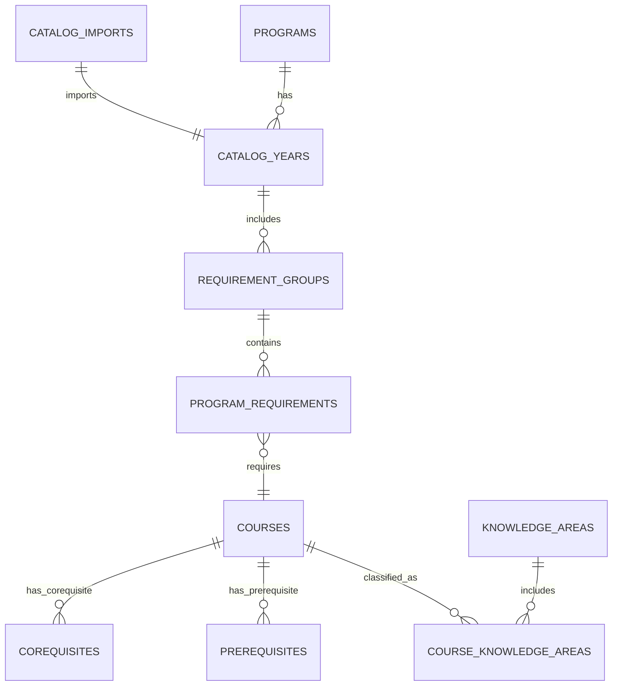

# SFBU ECE Program Explorer – Database Design Specification

**Version:** 1.0
**Status:** Draft
**Revision History:**
| Version | Date       | Author       | Description                  |
|---------|------------|--------------|------------------------------|
| 1.0     | 2024-06-01 | SFBU ECE Team| Initial draft of specification|

---

## 1. Purpose

This document specifies the database design for the SFBU ECE Program Explorer application. It outlines the data model, entities, relationships, and design principles to support a flexible, maintainable, and scalable database backend that powers the exploration and analysis of Electrical and Computer Engineering (ECE) academic programs and their requirements at San Francisco Bay University (SFBU).

---

## 2. Database Goals

- Provide a normalized and consistent data model representing ECE programs, course catalogs, and requirements.
- Support versioning of academic catalogs to reflect changes over time.
- Ensure data integrity and referential consistency.
- Facilitate efficient querying for program and course requirement exploration.
- Enable extensibility to accommodate future program changes.
- Support auditability and traceability of data changes.
- Integrate with application layers via ORM for maintainability.

---

## 3. Scope and Out-of-Scope

### In Scope
- Representation of academic programs and their degree requirements.
- Storage of course information, knowledge areas, and prerequisite structures.
- Versioned catalogs capturing program requirements by academic year.
- Import workflows for catalog data ingestion.

### Out of Scope
- Student records, enrollment data, and grades.
- Student Information System (SIS) data integration.
- Real-time registration or academic progress tracking.
- Financial or administrative data.

---

## 4. Database Technology

- **Database Engine:** PostgreSQL (preferred for advanced relational features and extensibility).
- **ORM:** TypeORM (consistent with architecture specification; integrates natively with NestJS).

---

## 5. Database Design Principles

- **Normalization:** Data schema will adhere to Third Normal Form (3NF) where practical to reduce redundancy and maintain data integrity.
- **Referential Integrity:** Foreign key constraints will enforce relationships between entities.
- **Audit Fields:** Common audit fields such as `created_at`, `updated_at`, and `deleted_at` (soft delete) will be included where applicable.
- **Catalog Versioning:** Catalog data will be versioned by academic year to support historical views and comparisons.
- **Consistency:** Use of controlled vocabularies and enumerations where appropriate.
- **Extensibility:** Schema designed to accommodate future program changes and additional entities.

---

## 6. Conceptual Data Model

The database will include the following primary entities:

### Programs

Represents academic programs offered (e.g., Bachelor of Science in ECE).

### CatalogYears

Represents specific academic catalog years (e.g., 2023-2024) linked to programs.

### RequirementGroups

Logical groups of requirements within a program catalog (e.g., Core Courses, Electives).

### Courses

Course details including course code, title, description, and credit hours.

### KnowledgeAreas

Academic knowledge areas or domains associated with courses (e.g., Digital Systems, Signal Processing).

### CourseKnowledgeAreas

Associative entity linking courses to one or more knowledge areas.

### ProgramRequirements

Defines specific course or group requirements within a requirement group.

### Prerequisites

Defines prerequisite relationships between courses.

### Corequisites

Defines corequisite relationships between courses.

### CatalogImports

Tracks metadata about catalog data imports for audit and rollback.

### AcademicTerms

Semesters/terms in which courses may be offered (e.g. "Fall 2026"), with a `sort_order` for chronological ordering. Admin-managed.

### CourseOfferings

Join between AcademicTerms and Courses recording which courses are offered in a given term. Unique on (term_id, course_id); cascades on delete of either side. Admin-managed; powers the offerings/eligibility tool.

---

## 7. Mermaid ER Diagram


```mermaid
erDiagram
    PROGRAMS ||--o{ CATALOG_YEARS : has
    CATALOG_YEARS ||--o{ REQUIREMENT_GROUPS : includes
    REQUIREMENT_GROUPS ||--o{ PROGRAM_REQUIREMENTS : contains
    PROGRAM_REQUIREMENTS }o--|| COURSES : requires
    COURSES ||--o{ COURSE_KNOWLEDGE_AREAS : classified_as
    KNOWLEDGE_AREAS ||--o{ COURSE_KNOWLEDGE_AREAS : includes
    COURSES ||--o{ PREREQUISITES : has_prerequisite
    COURSES ||--o{ COREQUISITES : has_corequisite
    CATALOG_IMPORTS ||--|| CATALOG_YEARS : imports
```

---

## 8. Entity Definitions

### Programs

| Field        | Data Type | PK | FK | Description                      |
|--------------|-----------|----|----|--------------------------------|
| id           | UUID      | ✓  |    | Unique program identifier       |
| name         | VARCHAR   |    |    | Full program name               |
| abbreviation | VARCHAR   |    |    | Program abbreviation/code       |
| description  | TEXT      |    |    | Program description             |
| created_at   | TIMESTAMP |    |    | Record creation timestamp       |
| updated_at   | TIMESTAMP |    |    | Record last update timestamp    |

---

### CatalogYears

| Field        | Data Type | PK | FK       | Description                           |
|--------------|-----------|----|----------|-------------------------------------|
| id           | UUID      | ✓  |          | Unique catalog year identifier       |
| program_id   | UUID      |    | Programs | Associated program                   |
| academic_year| VARCHAR   |    |          | Academic year (e.g., "2023-2024")   |
| effective_date | DATE    |    |          | Date when catalog becomes effective |
| created_at   | TIMESTAMP |    |          | Record creation timestamp            |
| updated_at   | TIMESTAMP |    |          | Record last update timestamp         |

---

### RequirementGroups

| Field          | Data Type | PK | FK           | Description                              |
|----------------|-----------|----|--------------|----------------------------------------|
| id             | UUID      | ✓  |              | Unique requirement group identifier     |
| catalog_year_id| UUID      |    | CatalogYears | Associated catalog year                 |
| name           | VARCHAR   |    |              | Name of the requirement group           |
| description    | TEXT      |    |              | Description of the group                 |
| created_at     | TIMESTAMP |    |              | Record creation timestamp                |
| updated_at     | TIMESTAMP |    |              | Record last update timestamp             |

---

### Courses

| Field        | Data Type | PK | FK | Description                        |
|--------------|-----------|----|----|----------------------------------|
| id           | UUID      | ✓  |    | Unique course identifier          |
| course_code  | VARCHAR   |    |    | Official course code (e.g., ECE101)|
| title        | VARCHAR   |    |    | Course title                     |
| description  | TEXT      |    |    | Course description               |
| credit_hours | NUMERIC   |    |    | Number of credit hours           |
| created_at   | TIMESTAMP |    |    | Record creation timestamp        |
| updated_at   | TIMESTAMP |    |    | Record last update timestamp     |

---

### KnowledgeAreas

| Field        | Data Type | PK | FK | Description                        |
|--------------|-----------|----|----|----------------------------------|
| id           | UUID      | ✓  |    | Unique knowledge area identifier  |
| name         | VARCHAR   |    |    | Knowledge area name               |
| description  | TEXT      |    |    | Description of knowledge area     |
| created_at   | TIMESTAMP |    |    | Record creation timestamp         |
| updated_at   | TIMESTAMP |    |    | Record last update timestamp      |

---

### CourseKnowledgeAreas

| Field           | Data Type | PK | FK           | Description                       |
|-----------------|-----------|----|--------------|---------------------------------|
| id              | UUID      | ✓  |              | Unique identifier                |
| course_id       | UUID      |    | Courses      | Associated course               |
| knowledge_area_id| UUID      |    | KnowledgeAreas| Associated knowledge area       |
| created_at      | TIMESTAMP |    |              | Record creation timestamp       |
| updated_at      | TIMESTAMP |    |              | Record last update timestamp    |

---

### ProgramRequirements

| Field               | Data Type | PK | FK               | Description                                           |
|---------------------|-----------|----|------------------|-------------------------------------------------------|
| id                  | UUID      | ✓  |                  | Unique program requirement identifier                 |
| requirement_group_id | UUID      |    | RequirementGroups| Associated requirement group                           |
| course_id           | UUID      |    | Courses          | Course required (nullable if group-based requirement) |
| min_credits         | NUMERIC   |    |                  | Minimum credits required (for elective groups)        |
| description         | TEXT      |    |                  | Additional requirement details                         |
| created_at          | TIMESTAMP |    |                  | Record creation timestamp                              |
| updated_at          | TIMESTAMP |    |                  | Record last update timestamp                           |

---

### Prerequisites

| Field        | Data Type | PK | FK     | Description                         |
|--------------|-----------|----|--------|-----------------------------------|
| id           | UUID      | ✓  |        | Unique prerequisite identifier    |
| course_id    | UUID      |    | Courses| Course that has the prerequisite  |
| prerequisite_course_id | UUID| | Courses| Course that is prerequisite       |
| alternative_group | SMALLINT | | | Groups interchangeable alternatives; NULL = required outright |
| created_at   | TIMESTAMP |    |        | Record creation timestamp         |
| updated_at   | TIMESTAMP |    |        | Record last update timestamp      |

---

### Corequisites

| Field        | Data Type | PK | FK     | Description                         |
|--------------|-----------|----|--------|-----------------------------------|
| id           | UUID      | ✓  |        | Unique corequisite identifier     |
| course_id    | UUID      |    | Courses| Course that has the corequisite   |
| corequisite_course_id | UUID |  | Courses| Course that is corequisite        |
| created_at   | TIMESTAMP |    |        | Record creation timestamp         |
| updated_at   | TIMESTAMP |    |        | Record last update timestamp      |

---

### CatalogImports

| Field         | Data Type | PK | FK           | Description                              |
|---------------|-----------|----|--------------|----------------------------------------|
| id            | UUID      | ✓  |              | Unique import record identifier         |
| catalog_year_id| UUID      |    | CatalogYears | Catalog year associated with import     |
| imported_at   | TIMESTAMP |    |              | Timestamp of import                      |
| source_file   | VARCHAR   |    |              | Filename or source of imported data      |
| status        | VARCHAR   |    |              | Import status (e.g., completed, failed) |
| created_at    | TIMESTAMP |    |              | Record creation timestamp                |
| updated_at    | TIMESTAMP |    |              | Record last update timestamp             |

---

## 9. Relationship Descriptions

- **Programs to CatalogYears:** One-to-many; a program can have multiple catalog years.
- **CatalogYears to RequirementGroups:** One-to-many; each catalog year contains multiple requirement groups.
- **RequirementGroups to ProgramRequirements:** One-to-many; each requirement group contains multiple requirements.
- **ProgramRequirements to Courses:** Many-to-one; requirements may specify courses.
- **Courses to CourseKnowledgeAreas:** One-to-many; courses can be associated with multiple knowledge areas.
- **KnowledgeAreas to CourseKnowledgeAreas:** One-to-many; knowledge areas can classify multiple courses.
- **Courses to Prerequisites:** One-to-many; courses may have multiple prerequisite courses.
- **Courses to Corequisites:** One-to-many; courses may have multiple corequisite courses.
- **CatalogImports to CatalogYears:** One-to-one; each catalog import corresponds to a catalog year.

---

## 10. Indexing Strategy

- Primary keys on all entity IDs (UUIDs).
- Foreign key indexes on all FK columns to optimize JOINs.
- Index on `course_code` in Courses for fast lookup.
- Index on `academic_year` in CatalogYears for filtering by year.
- Composite indexes on frequently queried relationships (e.g., ProgramRequirements by requirement_group_id and course_id).
- Full-text search indexes may be considered on course titles and descriptions for search functionality.

---

## 11. Migration Strategy

- Use a version-controlled migration tool (e.g., Flyway, Liquibase, or ORM migration tooling).
- Migrations will be incremental and reversible where possible.
- Test migrations in staging environments before production deployment.
- Maintain migration history in a dedicated schema table.
- Document all schema changes in revision history.

---

## 12. Seed Data Strategy

- Seed initial reference data such as KnowledgeAreas and base Programs.
- Seed sample CatalogYears and RequirementGroups for development and testing.
- Seed data scripts will be idempotent and versioned.
- Use environment-specific seeding to avoid overwriting production data.

### Knowledge Area Seed

`backend/src/database/seeds/catalog-data.ts` defines two exports that populate
the `knowledge_areas` and `course_knowledge_areas` tables:

- `KNOWLEDGE_AREAS` — 14 learning domains (name + description).
- `COURSE_KNOWLEDGE_AREAS` — maps each seeded course code to one or more area
  names, producing 77 joins across the 60 catalog courses.

Knowledge areas are a **pedagogical taxonomy layered over the catalog**, not a
catalog artifact. The published catalog organizes courses by requirement group;
these areas group them by subject matter so courses can be browsed across
program boundaries. A course may belong to more than one area (for example
CS581 Secure Software Development is both Cybersecurity and Software
Engineering), so the sum of area course counts exceeds the course total.

The seeder resolves areas by name and is idempotent: existing areas have their
description refreshed, and a join row is inserted only when absent. Unknown
course codes or area names are warned about and skipped rather than aborting
the run.

### Course Offering Seed

`COURSE_OFFERINGS` in the same file populates `course_offerings` — which courses
run in which academic term.

The academic terms themselves ("Fall 2026", "Spring 2027") are created by the
`CourseOfferings` migration, not by the seeder. The seeder resolves them **by
name** and warns/skips if one is missing, rather than creating it: a term that
the migration did not define means the environment is out of date, and silently
inventing one would hide that.

**Fall 2026 is transcribed from the real SFBU registration list**
(`docs/Fall 2026.md`), not generated to look plausible. The real term is
graduate Computer Science only — no undergraduate courses, no EE/CE, and no
EE595 capstone. Eight of its courses have catalog entries and are seeded:

`CS500`, `CS500L`, `CS501`, `CS550`, `CS570`, `CS571`, `CS575`, `CS595`

Six more appear on the official list with **no catalog entry**, so they are
omitted rather than invented: CS521, CS522, CS547, CS582, CS583, CS587. Seeding
offerings for non-existent courses would fail, and adding the courses needs
prerequisite, requirement-group and knowledge-area data the registration list
does not carry. This is a genuine catalog gap, tracked in TASKS.md.

**Spring 2027 is deliberately unseeded.** No real schedule exists for it, and
fabricating one would put invented availability in front of students. A term
with no offerings is treated as *not yet curated* (`offered: null`), never as
"offers nothing" — see the planner note below.

`Open For Registration`, section counts and the registrar's cancellation notes
**are** modeled, on `course_offerings`:

| Column | Meaning |
| --- | --- |
| `open_for_registration` | Registration is actually open. Defaults true, so offerings curated before the column existed keep their prior meaning. |
| `section_count` | Sections on the published schedule; null when unstated. |
| `status_note` | The registrar's wording, verbatim — "Cancelled due to low enrollment". Free text rather than an enum: the actual reason serves a student better than a category. |

An offering row therefore means "runs this term"; `open_for_registration` is the
separate question of whether a student can enrol. Of the 96 Fall 2026 offerings,
34 are closed and 18 carry a note.

**The source list contradicts itself on two courses.** CS500 and FIN310 carry
both a cancellation note and `Open For Registration: true`. Cancelled wins in the
seed — showing a cancelled course as registrable sends a student to enrol in
something that will not run, which is the costlier error.

Seeding is idempotent, but **insert-only**: it never deletes. Offerings removed
from `COURSE_OFFERINGS` are not pruned on reseed, because doing so would destroy
admin curation. Clear the table manually when correcting seed data:

```sql
DELETE FROM course_offerings;
```

#### What a reseed does and does not repair

| Data | On reseed |
| --- | --- |
| Courses | **Updated in place** by course code — title, credits, level and description are all corrected |
| Requirement groups | **Updated in place** by name — description, minCredits and sortOrder refreshed |
| Prerequisites, corequisites, knowledge-area joins | **Insert-only** — links that are no longer in the seed survive |
| Program requirements | Insert-only per (group, course) |

The asymmetry matters when a course's *identity* changes rather than just its
label. The `CatalogReconciliation1719446404000` migration exists for exactly
that: correcting 59 wrong course titles left every prerequisite and
knowledge-area link that had been inferred from the wrong identity still in
place, so the migration clears those three tables and lets the reseed rebuild
them. They hold no hand-authored data — there is no admin CRUD for them — so
clearing is safe.

Renaming a requirement group has the same shape: groups are matched by name, so
an old name is orphaned rather than updated, and its requirements go with it.
The same migration deletes the three MSEE groups that were renamed to the
catalog's wording.

#### Disjunctive prerequisites

The catalog states some prerequisites as alternatives — `CS480` requires
"CS250 or CS360". `alternative_group` expresses this: rows sharing a non-null
group for the same course are interchangeable, and satisfying any one satisfies
the group. Separate groups are ANDed with each other, as are rows with a null
group, so every prerequisite recorded before the column existed keeps exactly
its original meaning.

The group is scoped per course rather than globally, so a `smallint` suffices
and the existing `(course_id, prerequisite_course_id)` uniqueness still holds —
a course may not name the same prerequisite twice whichever group it is in.

Five courses use it today: `CS480` (CS250 or CS360), `CS480L` (CS250L or
CS360L), `CS556` (CS360 or CS500), and `DS520`/`DS565` (CS500 or DS501). Before
this was modeled they were omitted from `PREREQUISITES` entirely — recording
both sides would have demanded both courses — so they appeared to have no
prerequisite at all.

#### Empty schedule ≠ empty term

`PlannerService.loadOfferings` omits a term with zero offerings from its lookup
map entirely, so its courses report `offered: null`. An empty schedule means
nobody has curated that term yet; reporting `false` would tell a student, with
apparent authority, that every course in the catalog is unavailable.

---

## 13. Catalog Import Workflow

- Catalog import process ingests academic catalog data files.
- Validate data integrity and schema compliance before import.
- Create or update CatalogYear and associated entities atomically.
- Track import metadata in CatalogImports for auditing.
- Support rollback or re-import in case of errors.
- Notify application layers upon successful import for cache refresh.

---

## 14. Backup and Recovery Strategy

- Daily full backups of the PostgreSQL database.
- Incremental backups for point-in-time recovery.
- Offsite storage of backups for disaster recovery.
- Regular backup restoration tests to verify integrity.
- Use PostgreSQL WAL archiving for continuous recovery options.

---

## 15. Security Considerations

- Use role-based access control (RBAC) in the database to restrict data modification.
- Encrypt data in transit using TLS.
- Limit direct database access; use application APIs for all data operations.
- Sanitize and validate all inputs to prevent SQL injection.
- Audit logs enabled for sensitive operations (e.g., catalog imports).
- Secure storage of database credentials and secrets.

---

## 16. Performance Considerations

- Normalize schema to reduce redundancy but balance with query performance.
- Use appropriate indexes as outlined.
- Monitor slow queries and optimize with EXPLAIN plans.
- Cache frequently accessed data in application layer where appropriate.
- Partition large tables if needed in future (e.g., by academic year).
- Regular vacuum and analyze operations on PostgreSQL.

---

## 17. Future Database Enhancements

- Support for multi-campus or multi-department programs.
- Integration with SIS for read-only student progress data.
- Support for cross-listed courses and joint program requirements.
- Enhanced audit trail with detailed change history.
- Implementation of materialized views for complex reporting.

---

## 18. References

- [SRS.md](./SRS.md) – Software Requirements Specification
- [02-Architecture.md](./02-Architecture.md) – System Architecture Document
- [04-API.md](./04-API.md) – API Design Specification
- [05-UIUX.md](./05-UIUX.md) – User Interface and User Experience Design
- Epic 002 – Program and Catalog Data Modeling (Project Management Epic)

---
